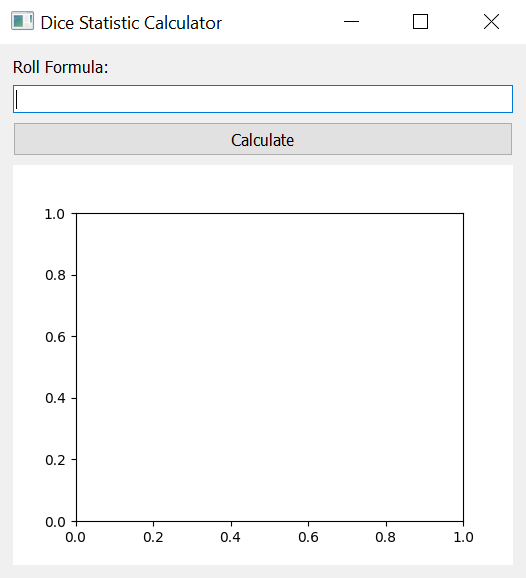
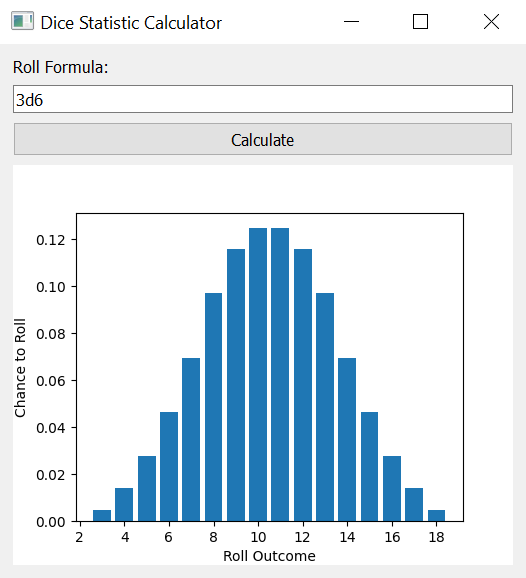
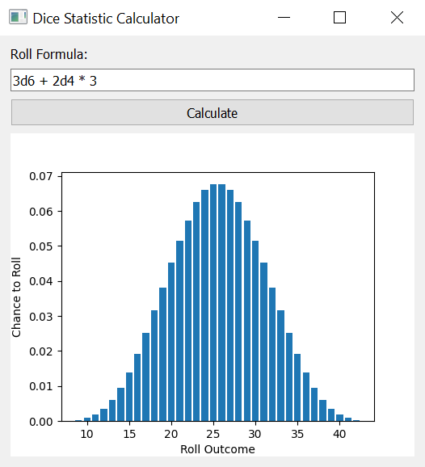

# Dice Statistics Calculator

| Table of Contents |
| ----------------- |
| [Introduction](#introduction) |
| [Setup and Run](#setup-and-run) |
| [How to use the Application](#how-to-use-the-application) |

## Introduction

The provided application calculates the possible outcomes, the chance of an outcome occurring, the average outcome value, and the standard deviation of outcomes for dice rolling formulas.

## Setup and Run

This repository uses a standard Python `requirements.txt` file.

After cloning the repo, simply navigate to its directory on your computer and run the following command:

```powershell
python -m pip install -r requirements.txt
```

Once it finishes installing the required modules, you can run the program with the following command:

```powershell
python dicecalc_main.py
```

The main window should popup.



## How to use the Application

Type your roll formula into the text box and click the "Calculate" button.
The possible outcomes and their chance of occurrence will appear as a histogram below.



The application also supports other arithmetic operations such as addition and multiplication.



The calculator follows order of operation with a dice roll taking precedence ahead of all operators.
